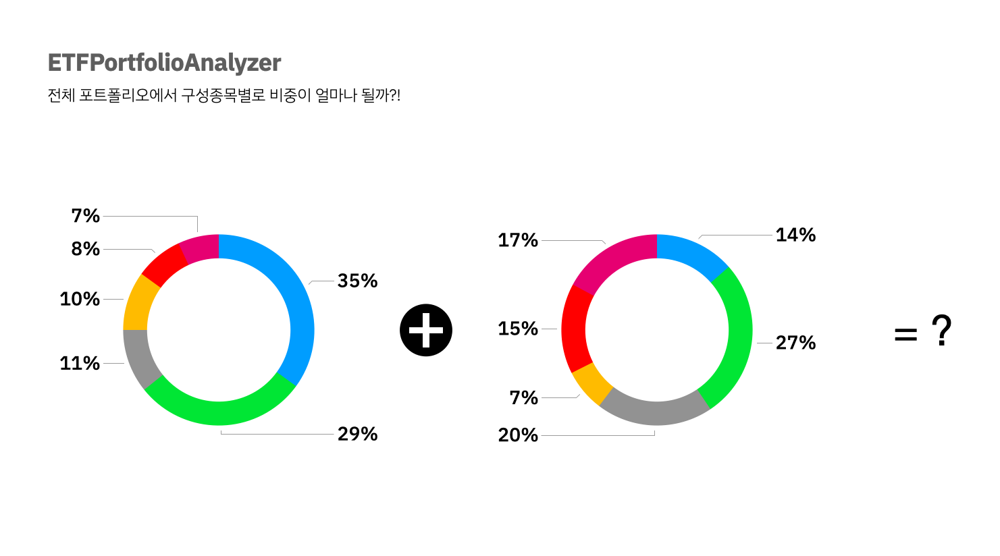

[](https://hits.seeyoufarm.com)

# ETFPortfolioAnalyzer

- "전체 포트폴리오에서 구성종목별로 비중이 얼마나 될까?"



- `KRX 정보데이터시스템`을 사용해 국내 ETF 기준가와 구성종목 비중 수집

- 나의 매수가에 맞추어 전체 비중에서 각 개별종목이 차지하는 비중 계산

## Functions

- 보유한 **국내 상장** ETF 종목 및 보유 주수 입력
- 전체 포트폴리오 비중 계산
- 시각화
- ETF 전체 목록 조회
- 각 ETF별 구성종목 조회

## APIs

### 전체 ETF 리스트 조회

#### Request
`GET /api/etfs`

```
curl -i -H `Accept: application/json` -d {HOST}/api/etfs
```

#### Response

```
HTTP/1.1 200 OK
Date: Fri, 31 Dec 2021 12:00:00 GMT
Status: 200 OK
Connection: close
Content-Type: application/json
Content-Length: 504

[{"ISU_SRT_CD":"152100","ISU_ABBRV":"ARIRANG 200"},{"ISU_SRT_CD":"295820","ISU_ABBRV":"ARIRANG 200동일가중"},{"ISU_SRT_CD":"253150","ISU_ABBRV":"ARIRANG 200선물레버리지"},{"ISU_SRT_CD":"253160","ISU_ABBRV":"ARIRANG 200선물인버스2X"},{"ISU_SRT_CD":"395750","ISU_ABBRV":"ARIRANG ESG가치주액티브"},{"ISU_SRT_CD":"395760","ISU_ABBRV":"ARIRANG ESG성장주액티브"},{"ISU_SRT_CD":"278420","ISU_ABBRV":"ARIRANG ESG우수기업"},{"ISU_SRT_CD":"292750","ISU_ABBRV":"ARIRANG KRX300"},{"ISU_SRT_CD":"309210","ISU_ABBRV":"ARIRANG KRX300헬스케어"},{"ISU_SRT_CD":"333940","ISU_ABBRV":"ARIRANG KS로우볼가중TR"},{"ISU_SRT_CD":"333950","ISU_ABBRV":"ARIRANG KS로우사이즈가중TR"},{"ISU_SRT_CD":"333960","ISU_ABBRV":"ARIRANG KS모멘텀가중TR"},{"ISU_SRT_CD":"333970","ISU_ABBRV":"ARIRANG KS밸류가중TR"},{"ISU_SRT_CD":"333980","ISU_ABBRV":"ARIRANG KS퀄리티가중TR"},{"ISU_SRT_CD":"269530","ISU_ABBRV":"ARIRANG S&P글로벌인프라"},{"ISU_SRT_CD":"251590","ISU_ABBRV":"ARIRANG 고배당저변동50"},{"ISU_SRT_CD":"161510","ISU_ABBRV":"ARIRANG 고배당주"},{"ISU_SRT_CD":"251600","ISU_ABBRV":"ARIRANG 고배당주채권혼합"},{"ISU_SRT_CD":"289670","ISU_ABBRV":"ARIRANG 국채선물10년"},{"ISU_SRT_CD":"298340","ISU_ABBRV":"ARIRANG 국채선물3년"},{"ISU_SRT_CD":"189400","ISU_ABBRV":"ARIRANG 글로벌MSCI(합성 H)"},{"ISU_SRT_CD":"278620","ISU_ABBRV":"ARIRANG 단기채권액티브"},{"ISU_SRT_CD":"269540","ISU_ABBRV":"ARIRANG 미국S&P500(H)"},{"ISU_SRT_CD":"287180","ISU_ABBRV":"ARIRANG 미국나스닥테크"},{"ISU_SRT_CD":"213630","ISU_ABBRV":"ARIRANG 미국다우존스고배당주(합성 H)"},{"ISU_SRT_CD":"332610","ISU_ABBRV":"ARIRANG 미국단기우량회사채"},{"ISU_SRT_CD":"332620","ISU_ABBRV":"ARIRANG 미국장기우량회사채"},{"ISU_SRT_CD":"195970","ISU_ABBRV":"ARIRANG 선진국MSCI(합성 H)"},{"ISU_SRT_CD":"238670","ISU_ABBRV":"ARIRANG 스마트베타Quality채권혼합"},{"ISU_SRT_CD":"195980","ISU_ABBRV":"ARIRANG 신흥국MSCI(합성 H)"},{"ISU_SRT_CD":"373530","ISU_ABBRV":"ARIRANG 신흥국MSCI인버스(합성 H)"},{"ISU_SRT_CD":"256450","ISU_ABBRV":"ARIRANG 심천차이넥스트(합성)"},{"ISU_SRT_CD":"239660","ISU_ABBRV":"ARIRANG 우량회사채50 1년"},{"ISU_SRT_CD":"280920","ISU_ABBRV":"ARIRANG 주도업종"},{"ISU_SRT_CD":"266550","ISU_ABBRV":"ARIRANG 중형주저변동50"},{"ISU_SRT_CD":"301400","ISU_ABBRV":"ARIRANG 코스닥150"},{"ISU_SRT_CD":"301410","ISU_ABBRV":"ARIRANG 코스닥150선물인버스"},{"ISU_SRT_CD":"227830","ISU_ABBRV":"ARIRANG 코스피"},{"ISU_SRT_CD":"122090","ISU_ABBRV":"ARIRANG 코스피50"},{"ISU_SRT_CD":"328370","ISU_ABBRV":"ARIRANG 코스피TR"},{"ISU_SRT_CD":"301440","ISU_ABBRV":"ARIRANG 코스피중형주"},{"ISU_SRT_CD":"376250","ISU_ABBRV":"ARIRANG 탄소효율그린뉴딜"},{"ISU_SRT_CD":"285690","ISU_ABBRV":"FOCUS ESG리더스"},{"ISU_SRT_CD":"292730","ISU_ABBRV":"FOCUS KRX300"},{"ISU_SRT_CD":"402520","ISU_ABBRV":"FOCUS 혁신기업액티브"},{"ISU_SRT_CD":"293180","ISU_ABBRV":"HANARO 200"},{"ISU_SRT_CD":"407310","ISU_ABBRV":"HANARO 200 TOP10"},{"ISU_SRT_CD":"332930","ISU_ABBRV":"HANARO 200TR"},{"ISU_SRT_CD":"304780","ISU_ABBRV":"HANARO 200선물레버리지"},{"ISU_SRT_CD":"306520","ISU_ABBRV":"HANARO 200선물인버스"},{"ISU_SRT_CD":"395290","ISU_ABBRV":"HANARO Fn K-POP&미디어"},{"ISU_SRT_CD":"395280","ISU_ABBRV":"HANARO Fn K-게임"},{"ISU_SRT_CD":"368190","ISU_ABBRV":"HANARO Fn K-뉴딜디지털플러스"},{"ISU_SRT_CD":"402460","ISU_ABBRV":"HANARO Fn K-메타버스MZ"},{"ISU_SRT_CD":"395270","ISU_ABBRV":"HANARO Fn K-반도체"},{"ISU_SRT_CD":"367740","ISU_ABBRV":"HANARO Fn5G산업"},{"ISU_SRT_CD":"407300","ISU_ABBRV":"HANARO Fn골프테마"},{"ISU_SRT_CD":"381560","ISU_ABBRV":"HANARO Fn전기&수소차"},{"ISU_SRT_CD":"381570","ISU_ABBRV":"HANARO Fn친환경에너지"},{"ISU_SRT_CD":"346000","ISU_ABBRV":"HANARO KAP초장기국고채"},{"ISU_SRT_CD":"304760","ISU_ABBRV":"HANARO KRX300"},{"ISU_SRT_CD":"404470","ISU_ABBRV":"HANARO KRX기후변화솔루션"},{"ISU_SRT_CD":"332940","ISU_ABBRV":"HANARO MSCI Korea TR"},{"ISU_SRT_CD":"322400","ISU_ABBRV":"HANARO e커머스"},{"ISU_SRT_CD":"322410","ISU_ABBRV":"HANARO 고배당"},{"ISU_SRT_CD":"354350","ISU_ABBRV":"HANARO 글로벌럭셔리S&P(합성)"},{"ISU_SRT_CD":"401590","ISU_ABBRV":"HANARO 글로벌탄소배출권선물ICE(합성)"},{"ISU_SRT_CD":"314700","ISU_ABBRV":"HANARO 농업융복합산업"},{"ISU_SRT_CD":"390950","ISU_ABBRV":"HANARO 단기채권액티브"},{"ISU_SRT_CD":"304770","ISU_ABBRV":"HANARO 코스닥150"},{"ISU_SRT_CD":"306530","ISU_ABBRV":"HANARO 코스닥150선물레버리지"},{"ISU_SRT_CD":"375760","ISU_ABBRV":"HANARO 탄소효율그린뉴딜"},{"ISU_SRT_CD":"215620","ISU_ABBRV":"HK S&P코리아로우볼"},{"ISU_SRT_CD":"391670","ISU_ABBRV":"HK 베스트일레븐액티브"},{"ISU_SRT_CD":"391680","ISU_ABBRV":"HK 하이볼액티브"},{"ISU_SRT_CD":"148020","ISU_ABBRV":"KBSTAR 200"},{"ISU_SRT_CD":"285000","ISU_ABBRV":"KBSTAR 200IT"},{"ISU_SRT_CD":"361580","ISU_ABBRV":"KBSTAR 200TR"},{"ISU_SRT_CD":"287300","ISU_ABBRV":"KBSTAR 200건설"},{"ISU_SRT_CD":"287310","ISU_ABBRV":"KBSTAR 200경기소비재"},{"ISU_SRT_CD":"290080","ISU_ABBRV":"KBSTAR 200고배당커버드콜ATM"},{"ISU_SRT_CD":"284980","ISU_ABBRV":"KBSTAR 200금융"},{"ISU_SRT_CD":"287320","ISU_ABBRV":"KBSTAR 200산업재"},{"ISU_SRT_CD":"287330","ISU_ABBRV":"KBSTAR 200생활소비재"},{"ISU_SRT_CD":"252400","ISU_ABBRV":"KBSTAR 200선물레버리지"},{"ISU_SRT_CD":"252410","ISU_ABBRV":"KBSTAR 200선물인버스"},{"ISU_SRT_CD":"252420","ISU_ABBRV":"KBSTAR 200선물인버스2X"},{"ISU_SRT_CD":"284990","ISU_ABBRV":"KBSTAR 200에너지화학"},{"ISU_SRT_CD":"285010","ISU_ABBRV":"KBSTAR 200중공업"},{"ISU_SRT_CD":"285020","ISU_ABBRV":"KBSTAR 200철강소재"},{"ISU_SRT_CD":"315480","ISU_ABBRV":"KBSTAR 200커뮤니케이션서비스"},{"ISU_SRT_CD":"105780","ISU_ABBRV":"KBSTAR 5대그룹주"},{"ISU_SRT_CD":"290130","ISU_ABBRV":"KBSTAR ESG사회책임투자"},{"ISU_SRT_CD":"368200","ISU_ABBRV":"KBSTAR Fn K-뉴딜디지털플러스"},{"ISU_SRT_CD":"367760","ISU_ABBRV":"KBSTAR Fn5G테크"},{"ISU_SRT_CD":"367770","ISU_ABBRV":"KBSTAR Fn수소경제테마"},{"ISU_SRT_CD":"388280","ISU_ABBRV":"KBSTAR Fn컨택트대표"},{"ISU_SRT_CD":"326240","ISU_ABBRV":"KBSTAR IT플러스"},{"ISU_SRT_CD":"385560","ISU_ABBRV":"KBSTAR KIS국고채30년Enhanced"},{"ISU_SRT_CD":"385550","ISU_ABBRV":"KBSTAR KIS단기종합채권(AA-이상)액티브"},{"ISU_SRT_CD":"385540","ISU_ABBRV":"KBSTAR KIS종합채권(A-이상)액티브"},{"ISU_SRT_CD":"270800","ISU_ABBRV":"KBSTAR KQ고배당"},{"ISU_SRT_CD":"292050","ISU_ABBRV":"KBSTAR KRX300"},{"ISU_SRT_CD":"307010","ISU_ABBRV":"KBSTAR KRX300레버리지"},{"ISU_SRT_CD":"319870","ISU_ABBRV":"KBSTAR KRX300미국달러선물혼합"},{"ISU_SRT_CD":"403990","ISU_ABBRV":"KBSTAR KRX기후변화솔루션"},{"ISU_SRT_CD":"234310","ISU_ABBRV":"KBSTAR V&S셀렉트밸류"},{"ISU_SRT_CD":"241390","ISU_ABBRV":"KBSTAR V&S셀렉트밸류채권혼합"},{"ISU_SRT_CD":"401170","ISU_ABBRV":"KBSTAR iSelect메타버스"},{"ISU_SRT_CD":"300640","ISU_ABBRV":"KBSTAR 게임테마"},{"ISU_SRT_CD":"266160","ISU_ABBRV":"KBSTAR 고배당"},{"ISU_SRT_CD":"114100","ISU_ABBRV":"KBSTAR 국고채3년"},{"ISU_SRT_CD":"282000","ISU_ABBRV":"KBSTAR 국고채3년선물인버스"},{"ISU_SRT_CD":"295000","ISU_ABBRV":"KBSTAR 국채선물10년"},{"ISU_SRT_CD":"295020","ISU_ABBRV":"KBSTAR 국채선물10년인버스"},{"ISU_SRT_CD":"397420","ISU_ABBRV":"KBSTAR 국채선물5년추종"},{"ISU_SRT_CD":"397410","ISU_ABBRV":"KBSTAR 국채선물5년추종인버스"},{"ISU_SRT_CD":"276650","ISU_ABBRV":"KBSTAR 글로벌4차산업IT(합성 H)"},{"ISU_SRT_CD":"375270","ISU_ABBRV":"KBSTAR 글로벌데이터센터리츠나스닥(합성)"},{"ISU_SRT_CD":"411720","ISU_ABBRV":"KBSTAR 글로벌메타버스Moorgate"},{"ISU_SRT_CD":"399580","ISU_ABBRV":"KBSTAR 글로벌클린에너지S&P"},{"ISU_SRT_CD":"336160","ISU_ABBRV":"KBSTAR 금융채액티브"},{"ISU_SRT_CD":"326230","ISU_ABBRV":"KBSTAR 내수주플러스"},{"ISU_SRT_CD":"272560","ISU_ABBRV":"KBSTAR 단기국공채액티브"},{"ISU_SRT_CD":"196230","ISU_ABBRV":"KBSTAR 단기통안채"},{"ISU_SRT_CD":"315960","ISU_ABBRV":"KBSTAR 대형고배당10TR"},{"ISU_SRT_CD":"252730","ISU_ABBRV":"KBSTAR 모멘텀로우볼"},{"ISU_SRT_CD":"252720","ISU_ABBRV":"KBSTAR 모멘텀밸류"},{"ISU_SRT_CD":"379780","ISU_ABBRV":"KBSTAR 미국S&P500"},{"ISU_SRT_CD":"219390","ISU_ABBRV":"KBSTAR 미국S&P원유생산기업(합성 H)"},{"ISU_SRT_CD":"354240","ISU_ABBRV":"KBSTAR 미국고정배당우선증권ICE TR"},{"ISU_SRT_CD":"368590","ISU_ABBRV":"KBSTAR 미국나스닥100"},{"ISU_SRT_CD":"267440","ISU_ABBRV":"KBSTAR 미국장기국채선물(H)"},{"ISU_SRT_CD":"267490","ISU_ABBRV":"KBSTAR 미국장기국채선물레버리지(합성 H)"},{"ISU_SRT_CD":"267450","ISU_ABBRV":"KBSTAR 미국장기국채선물인버스(H)"},{"ISU_SRT_CD":"267500","ISU_ABBRV":"KBSTAR 미국장기국채선물인버스2X(합성 H)"},{"ISU_SRT_CD":"388420","ISU_ABBRV":"KBSTAR 비메모리반도체액티브"},{"ISU_SRT_CD":"140570","ISU_ABBRV":"KBSTAR 수출주"},{"ISU_SRT_CD":"140580","ISU_ABBRV":"KBSTAR 우량업종"},{"ISU_SRT_CD":"379790","ISU_ABBRV":"KBSTAR 유로스탁스50(H)"},{"ISU_SRT_CD":"183710","ISU_ABBRV":"KBSTAR 주식혼합"},{"ISU_SRT_CD":"310080","ISU_ABBRV":"KBSTAR 중국MSCI China(H)"},{"ISU_SRT_CD":"174360","ISU_ABBRV":"KBSTAR 중국본토대형주CSI100"},{"ISU_SRT_CD":"136340","ISU_ABBRV":"KBSTAR 중기우량회사채"},{"ISU_SRT_CD":"281990","ISU_ABBRV":"KBSTAR 중소형고배당"},{"ISU_SRT_CD":"272570","ISU_ABBRV":"KBSTAR 중장기국공채액티브"},{"ISU_SRT_CD":"250730","ISU_ABBRV":"KBSTAR 차이나HSCEI(H)"},{"ISU_SRT_CD":"291680","ISU_ABBRV":"KBSTAR 차이나H선물인버스(H)"},{"ISU_SRT_CD":"371150","ISU_ABBRV":"KBSTAR 차이나항셍테크"},{"ISU_SRT_CD":"183700","ISU_ABBRV":"KBSTAR 채권혼합"},{"ISU_SRT_CD":"270810","ISU_ABBRV":"KBSTAR 코스닥150"},{"ISU_SRT_CD":"278240","ISU_ABBRV":"KBSTAR 코스닥150선물레버리지"},{"ISU_SRT_CD":"275750","ISU_ABBRV":"KBSTAR 코스닥150선물인버스"},{"ISU_SRT_CD":"302450","ISU_ABBRV":"KBSTAR 코스피"},{"ISU_SRT_CD":"361590","ISU_ABBRV":"KBSTAR 코스피ex200"},{"ISU_SRT_CD":"334690","ISU_ABBRV":"KBSTAR 팔라듐선물(H)"},{"ISU_SRT_CD":"334700","ISU_ABBRV":"KBSTAR 팔라듐선물인버스(H)"},{"ISU_SRT_CD":"253280","ISU_ABBRV":"KBSTAR 헬스케어"},{"ISU_SRT_CD":"253290","ISU_ABBRV":"KBSTAR 헬스케어채권혼합"},{"ISU_SRT_CD":"105190","ISU_ABBRV":"KINDEX 200"},{"ISU_SRT_CD":"332500","ISU_ABBRV":"KINDEX 200TR"},{"ISU_SRT_CD":"368470","ISU_ABBRV":"KINDEX Fn K-뉴딜디지털플러스"},{"ISU_SRT_CD":"380340","ISU_ABBRV":"KINDEX Fn5G플러스"},{"ISU_SRT_CD":"226380","ISU_ABBRV":"KINDEX Fn성장소비주도주"},{"ISU_SRT_CD":"356540","ISU_ABBRV":"KINDEX KIS종합채권(AA-이상)액티브"},{"ISU_SRT_CD":"411060","ISU_ABBRV":"KINDEX KRX금현물"},{"ISU_SRT_CD":"277540","ISU_ABBRV":"KINDEX S&P아시아TOP50"},{"ISU_SRT_CD":"225130","ISU_ABBRV":"KINDEX 골드선물 레버리지(합성 H)"},{"ISU_SRT_CD":"365780","ISU_ABBRV":"KINDEX 국고채10년"},{"ISU_SRT_CD":"114460","ISU_ABBRV":"KINDEX 국고채3년"},{"ISU_SRT_CD":"299070","ISU_ABBRV":"KINDEX 국채선물10년인버스"},{"ISU_SRT_CD":"299080","ISU_ABBRV":"KINDEX 국채선물3년인버스"},{"ISU_SRT_CD":"190620","ISU_ABBRV":"KINDEX 단기통안채"},{"ISU_SRT_CD":"265690","ISU_ABBRV":"KINDEX 러시아MSCI(합성)"},{"ISU_SRT_CD":"152500","ISU_ABBRV":"KINDEX 레버리지"},{"ISU_SRT_CD":"291130","ISU_ABBRV":"KINDEX 멕시코MSCI(합성)"},{"ISU_SRT_CD":"342140","ISU_ABBRV":"KINDEX 모닝스타싱가포르리츠채권혼합"},{"ISU_SRT_CD":"280320","ISU_ABBRV":"KINDEX 미국IT인터넷S&P(합성 H)"},{"ISU_SRT_CD":"360200","ISU_ABBRV":"KINDEX 미국S&P500"},{"ISU_SRT_CD":"309230","ISU_ABBRV":"KINDEX 미국WideMoat가치주"},{"ISU_SRT_CD":"402970","ISU_ABBRV":"KINDEX 미국고배당S&P"},{"ISU_SRT_CD":"367380","ISU_ABBRV":"KINDEX 미국나스닥100"},{"ISU_SRT_CD":"181480","ISU_ABBRV":"KINDEX 미국다우존스리츠(합성 H)"},{"ISU_SRT_CD":"391590","ISU_ABBRV":"KINDEX 미국스팩&IPO INDXX"},{"ISU_SRT_CD":"391600","ISU_ABBRV":"KINDEX 미국친환경그린테마INDXX"},{"ISU_SRT_CD":"143460","ISU_ABBRV":"KINDEX 밸류대형"},{"ISU_SRT_CD":"245710","ISU_ABBRV":"KINDEX 베트남VN30(합성)"},{"ISU_SRT_CD":"371130","ISU_ABBRV":"KINDEX 블룸버그베트남VN30선물레버리지(H)"},{"ISU_SRT_CD":"131890","ISU_ABBRV":"KINDEX 삼성그룹동일가중"},{"ISU_SRT_CD":"108450","ISU_ABBRV":"KINDEX 삼성그룹섹터가중"},{"ISU_SRT_CD":"322130","ISU_ABBRV":"KINDEX 스마트로우볼"},{"ISU_SRT_CD":"272220","ISU_ABBRV":"KINDEX 스마트모멘텀"},{"ISU_SRT_CD":"272230","ISU_ABBRV":"KINDEX 스마트밸류"},{"ISU_SRT_CD":"322120","ISU_ABBRV":"KINDEX 스마트퀄리티"},{"ISU_SRT_CD":"322150","ISU_ABBRV":"KINDEX 스마트하이베타"},{"ISU_SRT_CD":"316300","ISU_ABBRV":"KINDEX 싱가포르리츠"},{"ISU_SRT_CD":"256440","ISU_ABBRV":"KINDEX 인도네시아MSCI(합성)"},{"ISU_SRT_CD":"145670","ISU_ABBRV":"KINDEX 인버스"},{"ISU_SRT_CD":"238720","ISU_ABBRV":"KINDEX 일본Nikkei225(H)"},{"ISU_SRT_CD":"196030","ISU_ABBRV":"KINDEX 일본TOPIX레버리지(H)"},{"ISU_SRT_CD":"205720","ISU_ABBRV":"KINDEX 일본TOPIX인버스(합성 H)"},{"ISU_SRT_CD":"168580","ISU_ABBRV":"KINDEX 중국본토CSI300"},{"ISU_SRT_CD":"219900","ISU_ABBRV":"KINDEX 중국본토CSI300레버리지(합성)"},{"ISU_SRT_CD":"272910","ISU_ABBRV":"KINDEX 중장기국공채액티브"},{"ISU_SRT_CD":"371870","ISU_ABBRV":"KINDEX 차이나항셍테크"},{"ISU_SRT_CD":"251890","ISU_ABBRV":"KINDEX 코스닥(합성)"},{"ISU_SRT_CD":"354500","ISU_ABBRV":"KINDEX 코스닥150"},{"ISU_SRT_CD":"305050","ISU_ABBRV":"KINDEX 코스피"},{"ISU_SRT_CD":"261920","ISU_ABBRV":"KINDEX 필리핀MSCI(합성)"},{"ISU_SRT_CD":"069500","ISU_ABBRV":"KODEX 200"},{"ISU_SRT_CD":"226980","ISU_ABBRV":"KODEX 200 중소형"},{"ISU_SRT_CD":"337160","ISU_ABBRV":"KODEX 200ESG"},{"ISU_SRT_CD":"363580","ISU_ABBRV":"KODEX 200IT TR"},{"ISU_SRT_CD":"278530","ISU_ABBRV":"KODEX 200TR"},{"ISU_SRT_CD":"337150","ISU_ABBRV":"KODEX 200exTOP"},{"ISU_SRT_CD":"223190","ISU_ABBRV":"KODEX 200가치저변동"},{"ISU_SRT_CD":"252650","ISU_ABBRV":"KODEX 200동일가중"},{"ISU_SRT_CD":"360140","ISU_ABBRV":"KODEX 200롱코스닥150숏선물"},{"ISU_SRT_CD":"284430","ISU_ABBRV":"KODEX 200미국채혼합"},{"ISU_SRT_CD":"252670","ISU_ABBRV":"KODEX 200선물인버스2X"},{"ISU_SRT_CD":"305720","ISU_ABBRV":"KODEX 2차전지산업"},{"ISU_SRT_CD":"271060","ISU_ABBRV":"KODEX 3대농산물선물(H)"},{"ISU_SRT_CD":"368680","ISU_ABBRV":"KODEX Fn K-뉴딜디지털플러스"},{"ISU_SRT_CD":"395170","ISU_ABBRV":"KODEX Fn Top10동일가중"},{"ISU_SRT_CD":"337120","ISU_ABBRV":"KODEX Fn멀티팩터"},{"ISU_SRT_CD":"325010","ISU_ABBRV":"KODEX Fn성장"},{"ISU_SRT_CD":"395160","ISU_ABBRV":"KODEX Fn시스템반도체"},{"ISU_SRT_CD":"395150","ISU_ABBRV":"KODEX Fn웹툰&드라마"},{"ISU_SRT_CD":"266370","ISU_ABBRV":"KODEX IT"},{"ISU_SRT_CD":"401470","ISU_ABBRV":"KODEX K-메타버스액티브"},{"ISU_SRT_CD":"385520","ISU_ABBRV":"KODEX K-미래차액티브"},{"ISU_SRT_CD":"385510","ISU_ABBRV":"KODEX K-신재생에너지액티브"},{"ISU_SRT_CD":"373490","ISU_ABBRV":"KODEX K-이노베이션액티브"},{"ISU_SRT_CD":"292190","ISU_ABBRV":"KODEX KRX300"},{"ISU_SRT_CD":"306950","ISU_ABBRV":"KODEX KRX300레버리지"},{"ISU_SRT_CD":"404260","ISU_ABBRV":"KODEX KRX기후변화솔루션"},{"ISU_SRT_CD":"229720","ISU_ABBRV":"KODEX KTOP30"},{"ISU_SRT_CD":"291890","ISU_ABBRV":"KODEX MSCI EM선물(H)"},{"ISU_SRT_CD":"289040","ISU_ABBRV":"KODEX MSCI KOREA ESG유니버설"},{"ISU_SRT_CD":"156080","ISU_ABBRV":"KODEX MSCI Korea"},{"ISU_SRT_CD":"278540","ISU_ABBRV":"KODEX MSCI Korea TR"},{"ISU_SRT_CD":"275280","ISU_ABBRV":"KODEX MSCI모멘텀"},{"ISU_SRT_CD":"275290","ISU_ABBRV":"KODEX MSCI밸류"},{"ISU_SRT_CD":"275300","ISU_ABBRV":"KODEX MSCI퀄리티"},{"ISU_SRT_CD":"269420","ISU_ABBRV":"KODEX S&P글로벌인프라(합성)"},{"ISU_SRT_CD":"329650","ISU_ABBRV":"KODEX TRF3070"},{"ISU_SRT_CD":"329660","ISU_ABBRV":"KODEX TRF5050"},{"ISU_SRT_CD":"329670","ISU_ABBRV":"KODEX TRF7030"},{"ISU_SRT_CD":"352540","ISU_ABBRV":"KODEX TSE일본리츠(H)"},{"ISU_SRT_CD":"315930","ISU_ABBRV":"KODEX Top5PlusTR"},{"ISU_SRT_CD":"261220","ISU_ABBRV":"KODEX WTI원유선물(H)"},{"ISU_SRT_CD":"271050","ISU_ABBRV":"KODEX WTI원유선물인버스(H)"},{"ISU_SRT_CD":"117700","ISU_ABBRV":"KODEX 건설"},{"ISU_SRT_CD":"300950","ISU_ABBRV":"KODEX 게임산업"},{"ISU_SRT_CD":"266390","ISU_ABBRV":"KODEX 경기소비재"},{"ISU_SRT_CD":"279530","ISU_ABBRV":"KODEX 고배당"},{"ISU_SRT_CD":"132030","ISU_ABBRV":"KODEX 골드선물(H)"},{"ISU_SRT_CD":"280940","ISU_ABBRV":"KODEX 골드선물인버스(H)"},{"ISU_SRT_CD":"138910","ISU_ABBRV":"KODEX 구리선물(H)"},{"ISU_SRT_CD":"114260","ISU_ABBRV":"KODEX 국고채3년"},{"ISU_SRT_CD":"152380","ISU_ABBRV":"KODEX 국채선물10년"},{"ISU_SRT_CD":"176950","ISU_ABBRV":"KODEX 국채선물10년인버스"},{"ISU_SRT_CD":"292770","ISU_ABBRV":"KODEX 국채선물3년인버스"},{"ISU_SRT_CD":"276990","ISU_ABBRV":"KODEX 글로벌4차산업로보틱스(합성)"},{"ISU_SRT_CD":"102960","ISU_ABBRV":"KODEX 기계장비"},{"ISU_SRT_CD":"352560","ISU_ABBRV":"KODEX 다우존스미국리츠(H)"},{"ISU_SRT_CD":"273140","ISU_ABBRV":"KODEX 단기변동금리부채권액티브"},{"ISU_SRT_CD":"153130","ISU_ABBRV":"KODEX 단기채권"},{"ISU_SRT_CD":"214980","ISU_ABBRV":"KODEX 단기채권PLUS"},{"ISU_SRT_CD":"122630","ISU_ABBRV":"KODEX 레버리지"},{"ISU_SRT_CD":"321410","ISU_ABBRV":"KODEX 멀티에셋하이인컴(H)"},{"ISU_SRT_CD":"244620","ISU_ABBRV":"KODEX 모멘텀Plus"},{"ISU_SRT_CD":"314250","ISU_ABBRV":"KODEX 미국FANG플러스(H)"},{"ISU_SRT_CD":"379800","ISU_ABBRV":"KODEX 미국S&P500TR"},{"ISU_SRT_CD":"219480","ISU_ABBRV":"KODEX 미국S&P500선물(H)"},{"ISU_SRT_CD":"276970","ISU_ABBRV":"KODEX 미국S&P고배당커버드콜(합성 H)"},{"ISU_SRT_CD":"185680","ISU_ABBRV":"KODEX 미국S&P바이오(합성)"},{"ISU_SRT_CD":"200030","ISU_ABBRV":"KODEX 미국S&P산업재(합성)"},{"ISU_SRT_CD":"218420","ISU_ABBRV":"KODEX 미국S&P에너지(합성)"},{"ISU_SRT_CD":"379810","ISU_ABBRV":"KODEX 미국나스닥100TR"},{"ISU_SRT_CD":"409820","ISU_ABBRV":"KODEX 미국나스닥100레버리지(합성 H)"},{"ISU_SRT_CD":"304940","ISU_ABBRV":"KODEX 미국나스닥100선물(H)"},{"ISU_SRT_CD":"409810","ISU_ABBRV":"KODEX 미국나스닥100선물인버스(H)"},{"ISU_SRT_CD":"261240","ISU_ABBRV":"KODEX 미국달러선물"},{"ISU_SRT_CD":"261250","ISU_ABBRV":"KODEX 미국달러선물레버리지"},{"ISU_SRT_CD":"261270","ISU_ABBRV":"KODEX 미국달러선물인버스"},{"ISU_SRT_CD":"261260","ISU_ABBRV":"KODEX 미국달러선물인버스2X"},{"ISU_SRT_CD":"280930","ISU_ABBRV":"KODEX 미국러셀2000(H)"},{"ISU_SRT_CD":"411420","ISU_ABBRV":"KODEX 미국메타버스나스닥액티브"},{"ISU_SRT_CD":"390390","ISU_ABBRV":"KODEX 미국반도체MV"},{"ISU_SRT_CD":"390400","ISU_ABBRV":"KODEX 미국스마트모빌리티S&P"},{"ISU_SRT_CD":"308620","ISU_ABBRV":"KODEX 미국채10년선물"},{"ISU_SRT_CD":"304660","ISU_ABBRV":"KODEX 미국채울트라30년선물(H)"},{"ISU_SRT_CD":"304670","ISU_ABBRV":"KODEX 미국채울트라30년선물인버스(H)"},{"ISU_SRT_CD":"266360","ISU_ABBRV":"KODEX 미디어&엔터테인먼트"},{"ISU_SRT_CD":"244580","ISU_ABBRV":"KODEX 바이오"},{"ISU_SRT_CD":"091160","ISU_ABBRV":"KODEX 반도체"},{"ISU_SRT_CD":"325020","ISU_ABBRV":"KODEX 배당가치"},{"ISU_SRT_CD":"211900","ISU_ABBRV":"KODEX 배당성장"},{"ISU_SRT_CD":"237370","ISU_ABBRV":"KODEX 배당성장채권혼합"},{"ISU_SRT_CD":"244670","ISU_ABBRV":"KODEX 밸류Plus"},{"ISU_SRT_CD":"140700","ISU_ABBRV":"KODEX 보험"},{"ISU_SRT_CD":"102780","ISU_ABBRV":"KODEX 삼성그룹"},{"ISU_SRT_CD":"213610","ISU_ABBRV":"KODEX 삼성그룹밸류"},{"ISU_SRT_CD":"251350","ISU_ABBRV":"KODEX 선진국MSCI World"},{"ISU_SRT_CD":"117460","ISU_ABBRV":"KODEX 에너지화학"},{"ISU_SRT_CD":"140710","ISU_ABBRV":"KODEX 운송"},{"ISU_SRT_CD":"400570","ISU_ABBRV":"KODEX 유럽탄소배출권선물ICE(H)"},{"ISU_SRT_CD":"144600","ISU_ABBRV":"KODEX 은선물(H)"},{"ISU_SRT_CD":"091170","ISU_ABBRV":"KODEX 은행"},{"ISU_SRT_CD":"114800","ISU_ABBRV":"KODEX 인버스"},{"ISU_SRT_CD":"101280","ISU_ABBRV":"KODEX 일본TOPIX100"},{"ISU_SRT_CD":"091180","ISU_ABBRV":"KODEX 자동차"},{"ISU_SRT_CD":"363570","ISU_ABBRV":"KODEX 장기종합채권(AA-이상)액티브KAP"},{"ISU_SRT_CD":"273130","ISU_ABBRV":"KODEX 종합채권(AA-이상)액티브"},{"ISU_SRT_CD":"102970","ISU_ABBRV":"KODEX 증권"},{"ISU_SRT_CD":"169950","ISU_ABBRV":"KODEX 차이나A50"},{"ISU_SRT_CD":"283580","ISU_ABBRV":"KODEX 차이나CSI300"},{"ISU_SRT_CD":"099140","ISU_ABBRV":"KODEX 차이나H"},{"ISU_SRT_CD":"204450","ISU_ABBRV":"KODEX 차이나H레버리지(H)"},{"ISU_SRT_CD":"256750","ISU_ABBRV":"KODEX 차이나심천ChiNext(합성)"},{"ISU_SRT_CD":"372330","ISU_ABBRV":"KODEX 차이나항셍테크"},{"ISU_SRT_CD":"117680","ISU_ABBRV":"KODEX 철강"},{"ISU_SRT_CD":"279540","ISU_ABBRV":"KODEX 최소변동성"},{"ISU_SRT_CD":"229200","ISU_ABBRV":"KODEX 코스닥 150"},{"ISU_SRT_CD":"233740","ISU_ABBRV":"KODEX 코스닥150 레버리지"},{"ISU_SRT_CD":"360150","ISU_ABBRV":"KODEX 코스닥150롱코스피200숏선물"},{"ISU_SRT_CD":"251340","ISU_ABBRV":"KODEX 코스닥150선물인버스"},{"ISU_SRT_CD":"226490","ISU_ABBRV":"KODEX 코스피"},{"ISU_SRT_CD":"237350","ISU_ABBRV":"KODEX 코스피100"},{"ISU_SRT_CD":"359210","ISU_ABBRV":"KODEX 코스피TR"},{"ISU_SRT_CD":"337140","ISU_ABBRV":"KODEX 코스피대형주"},{"ISU_SRT_CD":"138920","ISU_ABBRV":"KODEX 콩선물(H)"},{"ISU_SRT_CD":"244660","ISU_ABBRV":"KODEX 퀄리티Plus"},{"ISU_SRT_CD":"375770","ISU_ABBRV":"KODEX 탄소효율그린뉴딜"},{"ISU_SRT_CD":"266410","ISU_ABBRV":"KODEX 필수소비재"},{"ISU_SRT_CD":"298770","ISU_ABBRV":"KODEX 한국대만IT프리미어"},{"ISU_SRT_CD":"266420","ISU_ABBRV":"KODEX 헬스케어"},{"ISU_SRT_CD":"364690","ISU_ABBRV":"KODEX 혁신기술테마액티브"},{"ISU_SRT_CD":"069660","ISU_ABBRV":"KOSEF 200"},{"ISU_SRT_CD":"294400","ISU_ABBRV":"KOSEF 200TR"},{"ISU_SRT_CD":"253250","ISU_ABBRV":"KOSEF 200선물레버리지"},{"ISU_SRT_CD":"253240","ISU_ABBRV":"KOSEF 200선물인버스"},{"ISU_SRT_CD":"253230","ISU_ABBRV":"KOSEF 200선물인버스2X"},{"ISU_SRT_CD":"331910","ISU_ABBRV":"KOSEF Fn중소형"},{"ISU_SRT_CD":"100910","ISU_ABBRV":"KOSEF KRX100"},{"ISU_SRT_CD":"104530","ISU_ABBRV":"KOSEF 고배당"},{"ISU_SRT_CD":"148070","ISU_ABBRV":"KOSEF 국고채10년"},{"ISU_SRT_CD":"167860","ISU_ABBRV":"KOSEF 국고채10년레버리지"},{"ISU_SRT_CD":"114470","ISU_ABBRV":"KOSEF 국고채3년"},{"ISU_SRT_CD":"130730","ISU_ABBRV":"KOSEF 단기자금"},{"ISU_SRT_CD":"411860","ISU_ABBRV":"KOSEF 독일DAX"},{"ISU_SRT_CD":"394340","ISU_ABBRV":"KOSEF 릭소글로벌디지털경제MSCI"},{"ISU_SRT_CD":"394350","ISU_ABBRV":"KOSEF 릭소글로벌퓨처모빌리티MSCI"},{"ISU_SRT_CD":"138230","ISU_ABBRV":"KOSEF 미국달러선물"},{"ISU_SRT_CD":"225800","ISU_ABBRV":"KOSEF 미국달러선물레버리지"},{"ISU_SRT_CD":"139660","ISU_ABBRV":"KOSEF 미국달러선물인버스"},{"ISU_SRT_CD":"230480","ISU_ABBRV":"KOSEF 미국달러선물인버스2X"},{"ISU_SRT_CD":"373790","ISU_ABBRV":"KOSEF 미국방어배당성장나스닥"},{"ISU_SRT_CD":"104520","ISU_ABBRV":"KOSEF 블루칩"},{"ISU_SRT_CD":"200250","ISU_ABBRV":"KOSEF 인도Nifty50(합성)"},{"ISU_SRT_CD":"316670","ISU_ABBRV":"KOSEF 코스닥150"},{"ISU_SRT_CD":"291630","ISU_ABBRV":"KOSEF 코스닥150선물레버리지"},{"ISU_SRT_CD":"291620","ISU_ABBRV":"KOSEF 코스닥150선물인버스"},{"ISU_SRT_CD":"153270","ISU_ABBRV":"KOSEF 코스피100"},{"ISU_SRT_CD":"122260","ISU_ABBRV":"KOSEF 통안채1년"},{"ISU_SRT_CD":"168300","ISU_ABBRV":"KTOP 코스피50"},{"ISU_SRT_CD":"407170","ISU_ABBRV":"MASTER 스마트커머스액티브"},{"ISU_SRT_CD":"407160","ISU_ABBRV":"MASTER 테크미디어텔레콤액티브"},{"ISU_SRT_CD":"411540","ISU_ABBRV":"SOL 200 Top10"},{"ISU_SRT_CD":"295040","ISU_ABBRV":"SOL 200TR"},{"ISU_SRT_CD":"363510","ISU_ABBRV":"SOL KIS단기통안채"},{"ISU_SRT_CD":"292500","ISU_ABBRV":"SOL KRX300"},{"ISU_SRT_CD":"404650","ISU_ABBRV":"SOL KRX기후변화솔루션"},{"ISU_SRT_CD":"400590","ISU_ABBRV":"SOL 글로벌탄소배출권선물IHS(합성)"},{"ISU_SRT_CD":"399110","ISU_ABBRV":"SOL 미국S&P500ESG"},{"ISU_SRT_CD":"208470","ISU_ABBRV":"SOL 선진국MSCI World(합성 H)"},{"ISU_SRT_CD":"400580","ISU_ABBRV":"SOL 유럽탄소배출권선물S&P(H)"},{"ISU_SRT_CD":"220130","ISU_ABBRV":"SOL 중국본토 중소형 CSI500(합성 H)"},{"ISU_SRT_CD":"413220","ISU_ABBRV":"SOL 차이나태양광CSI(합성)"},{"ISU_SRT_CD":"102110","ISU_ABBRV":"TIGER 200"},{"ISU_SRT_CD":"139260","ISU_ABBRV":"TIGER 200 IT"},{"ISU_SRT_CD":"139220","ISU_ABBRV":"TIGER 200 건설"},{"ISU_SRT_CD":"139290","ISU_ABBRV":"TIGER 200 경기소비재"},{"ISU_SRT_CD":"139270","ISU_ABBRV":"TIGER 200 금융"},{"ISU_SRT_CD":"227550","ISU_ABBRV":"TIGER 200 산업재"},{"ISU_SRT_CD":"227560","ISU_ABBRV":"TIGER 200 생활소비재"},{"ISU_SRT_CD":"139250","ISU_ABBRV":"TIGER 200 에너지화학"},{"ISU_SRT_CD":"139230","ISU_ABBRV":"TIGER 200 중공업"},{"ISU_SRT_CD":"139240","ISU_ABBRV":"TIGER 200 철강소재"},{"ISU_SRT_CD":"227540","ISU_ABBRV":"TIGER 200 헬스케어"},{"ISU_SRT_CD":"243880","ISU_ABBRV":"TIGER 200IT레버리지"},{"ISU_SRT_CD":"310960","ISU_ABBRV":"TIGER 200TR"},{"ISU_SRT_CD":"252000","ISU_ABBRV":"TIGER 200동일가중"},{"ISU_SRT_CD":"267770","ISU_ABBRV":"TIGER 200선물레버리지"},{"ISU_SRT_CD":"252710","ISU_ABBRV":"TIGER 200선물인버스2X"},{"ISU_SRT_CD":"243890","ISU_ABBRV":"TIGER 200에너지화학레버리지"},{"ISU_SRT_CD":"315270","ISU_ABBRV":"TIGER 200커뮤니케이션서비스"},{"ISU_SRT_CD":"166400","ISU_ABBRV":"TIGER 200커버드콜5%OTM"},{"ISU_SRT_CD":"289480","ISU_ABBRV":"TIGER 200커버드콜ATM"},{"ISU_SRT_CD":"305540","ISU_ABBRV":"TIGER 2차전지테마"},{"ISU_SRT_CD":"365040","ISU_ABBRV":"TIGER AI코리아그로스액티브"},{"ISU_SRT_CD":"357870","ISU_ABBRV":"TIGER CD금리투자KIS(합성)"},{"ISU_SRT_CD":"400970","ISU_ABBRV":"TIGER Fn메타버스"},{"ISU_SRT_CD":"396500","ISU_ABBRV":"TIGER Fn반도체TOP10"},{"ISU_SRT_CD":"377990","ISU_ABBRV":"TIGER Fn신재생에너지"},{"ISU_SRT_CD":"341850","ISU_ABBRV":"TIGER KIS부동산인프라채권TR"},{"ISU_SRT_CD":"364960","ISU_ABBRV":"TIGER KRX BBIG K-뉴딜"},{"ISU_SRT_CD":"412560","ISU_ABBRV":"TIGER KRX BBIG K-뉴딜레버리지"},{"ISU_SRT_CD":"364980","ISU_ABBRV":"TIGER KRX2차전지K-뉴딜"},{"ISU_SRT_CD":"412570","ISU_ABBRV":"TIGER KRX2차전지K-뉴딜레버리지"},{"ISU_SRT_CD":"292160","ISU_ABBRV":"TIGER KRX300"},{"ISU_SRT_CD":"364990","ISU_ABBRV":"TIGER KRX게임K-뉴딜"},{"ISU_SRT_CD":"404540","ISU_ABBRV":"TIGER KRX기후변화솔루션"},{"ISU_SRT_CD":"364970","ISU_ABBRV":"TIGER KRX바이오K-뉴딜"},{"ISU_SRT_CD":"365000","ISU_ABBRV":"TIGER KRX인터넷K-뉴딜"},{"ISU_SRT_CD":"228820","ISU_ABBRV":"TIGER KTOP30"},{"ISU_SRT_CD":"300610","ISU_ABBRV":"TIGER K게임"},{"ISU_SRT_CD":"138530","ISU_ABBRV":"TIGER LG그룹+펀더멘털"},{"ISU_SRT_CD":"289260","ISU_ABBRV":"TIGER MSCI KOREA ESG리더스"},{"ISU_SRT_CD":"289250","ISU_ABBRV":"TIGER MSCI KOREA ESG유니버설"},{"ISU_SRT_CD":"310970","ISU_ABBRV":"TIGER MSCI Korea TR"},{"ISU_SRT_CD":"269370","ISU_ABBRV":"TIGER S&P글로벌인프라(합성)"},{"ISU_SRT_CD":"248270","ISU_ABBRV":"TIGER S&P글로벌헬스케어(합성)"},{"ISU_SRT_CD":"292150","ISU_ABBRV":"TIGER TOP10"},{"ISU_SRT_CD":"217790","ISU_ABBRV":"TIGER 가격조정"},{"ISU_SRT_CD":"139280","ISU_ABBRV":"TIGER 경기방어"},{"ISU_SRT_CD":"237440","ISU_ABBRV":"TIGER 경기방어채권혼합"},{"ISU_SRT_CD":"319640","ISU_ABBRV":"TIGER 골드선물(H)"},{"ISU_SRT_CD":"160580","ISU_ABBRV":"TIGER 구리실물"},{"ISU_SRT_CD":"114820","ISU_ABBRV":"TIGER 국채3년"},{"ISU_SRT_CD":"275980","ISU_ABBRV":"TIGER 글로벌4차산업혁신기술(합성 H)"},{"ISU_SRT_CD":"387270","ISU_ABBRV":"TIGER 글로벌BBIG액티브"},{"ISU_SRT_CD":"394670","ISU_ABBRV":"TIGER 글로벌리튬&2차전지SOLACTIVE(합성)"},{"ISU_SRT_CD":"412770","ISU_ABBRV":"TIGER 글로벌메타버스액티브"},{"ISU_SRT_CD":"276000","ISU_ABBRV":"TIGER 글로벌자원생산기업(합성 H)"},{"ISU_SRT_CD":"394660","ISU_ABBRV":"TIGER 글로벌자율주행&전기차SOLACTIVE"},{"ISU_SRT_CD":"371450","ISU_ABBRV":"TIGER 글로벌클라우드컴퓨팅INDXX"},{"ISU_SRT_CD":"139310","ISU_ABBRV":"TIGER 금속선물(H)"},{"ISU_SRT_CD":"139320","ISU_ABBRV":"TIGER 금은선물(H)"},{"ISU_SRT_CD":"137610","ISU_ABBRV":"TIGER 농산물선물Enhanced(H)"},{"ISU_SRT_CD":"182490","ISU_ABBRV":"TIGER 단기선진하이일드(합성 H)"},{"ISU_SRT_CD":"272580","ISU_ABBRV":"TIGER 단기채권액티브"},{"ISU_SRT_CD":"157450","ISU_ABBRV":"TIGER 단기통안채"},{"ISU_SRT_CD":"105010","ISU_ABBRV":"TIGER 라틴35"},{"ISU_SRT_CD":"123320","ISU_ABBRV":"TIGER 레버리지"},{"ISU_SRT_CD":"174350","ISU_ABBRV":"TIGER 로우볼"},{"ISU_SRT_CD":"147970","ISU_ABBRV":"TIGER 모멘텀"},{"ISU_SRT_CD":"182480","ISU_ABBRV":"TIGER 미국MSCI리츠(합성 H)"},{"ISU_SRT_CD":"360750","ISU_ABBRV":"TIGER 미국S&P500"},{"ISU_SRT_CD":"225040","ISU_ABBRV":"TIGER 미국S&P500레버리지(합성 H)"},{"ISU_SRT_CD":"143850","ISU_ABBRV":"TIGER 미국S&P500선물(H)"},{"ISU_SRT_CD":"225030","ISU_ABBRV":"TIGER 미국S&P500선물인버스(H)"},{"ISU_SRT_CD":"133690","ISU_ABBRV":"TIGER 미국나스닥100"},{"ISU_SRT_CD":"203780","ISU_ABBRV":"TIGER 미국나스닥바이오"},{"ISU_SRT_CD":"245340","ISU_ABBRV":"TIGER 미국다우존스30"},{"ISU_SRT_CD":"329750","ISU_ABBRV":"TIGER 미국달러단기채권액티브"},{"ISU_SRT_CD":"261110","ISU_ABBRV":"TIGER 미국달러선물레버리지"},{"ISU_SRT_CD":"261120","ISU_ABBRV":"TIGER 미국달러선물인버스2X"},{"ISU_SRT_CD":"305080","ISU_ABBRV":"TIGER 미국채10년선물"},{"ISU_SRT_CD":"381170","ISU_ABBRV":"TIGER 미국테크TOP10 INDXX"},{"ISU_SRT_CD":"381180","ISU_ABBRV":"TIGER 미국필라델피아반도체나스닥"},{"ISU_SRT_CD":"228810","ISU_ABBRV":"TIGER 미디어컨텐츠"},{"ISU_SRT_CD":"091230","ISU_ABBRV":"TIGER 반도체"},{"ISU_SRT_CD":"098560","ISU_ABBRV":"TIGER 방송통신"},{"ISU_SRT_CD":"211560","ISU_ABBRV":"TIGER 배당성장"},{"ISU_SRT_CD":"329200","ISU_ABBRV":"TIGER 부동산인프라고배당"},{"ISU_SRT_CD":"138520","ISU_ABBRV":"TIGER 삼성그룹펀더멘털"},{"ISU_SRT_CD":"157490","ISU_ABBRV":"TIGER 소프트웨어"},{"ISU_SRT_CD":"228800","ISU_ABBRV":"TIGER 여행레저"},{"ISU_SRT_CD":"227570","ISU_ABBRV":"TIGER 우량가치"},{"ISU_SRT_CD":"261140","ISU_ABBRV":"TIGER 우선주"},{"ISU_SRT_CD":"130680","ISU_ABBRV":"TIGER 원유선물Enhanced(H)"},{"ISU_SRT_CD":"217770","ISU_ABBRV":"TIGER 원유선물인버스(H)"},{"ISU_SRT_CD":"195930","ISU_ABBRV":"TIGER 유로스탁스50(합성 H)"},{"ISU_SRT_CD":"225050","ISU_ABBRV":"TIGER 유로스탁스레버리지(합성 H)"},{"ISU_SRT_CD":"245350","ISU_ABBRV":"TIGER 유로스탁스배당30"},{"ISU_SRT_CD":"091220","ISU_ABBRV":"TIGER 은행"},{"ISU_SRT_CD":"307510","ISU_ABBRV":"TIGER 의료기기"},{"ISU_SRT_CD":"225060","ISU_ABBRV":"TIGER 이머징마켓MSCI레버리지(합성 H)"},{"ISU_SRT_CD":"236350","ISU_ABBRV":"TIGER 인도니프티50레버리지(합성)"},{"ISU_SRT_CD":"123310","ISU_ABBRV":"TIGER 인버스"},{"ISU_SRT_CD":"195920","ISU_ABBRV":"TIGER 일본TOPIX(합성 H)"},{"ISU_SRT_CD":"248260","ISU_ABBRV":"TIGER 일본TOPIX헬스케어(합성)"},{"ISU_SRT_CD":"241180","ISU_ABBRV":"TIGER 일본니케이225"},{"ISU_SRT_CD":"292560","ISU_ABBRV":"TIGER 일본엔선물"},{"ISU_SRT_CD":"150460","ISU_ABBRV":"TIGER 중국소비테마"},{"ISU_SRT_CD":"302190","ISU_ABBRV":"TIGER 중장기국채"},{"ISU_SRT_CD":"157500","ISU_ABBRV":"TIGER 증권"},{"ISU_SRT_CD":"307520","ISU_ABBRV":"TIGER 지주회사"},{"ISU_SRT_CD":"192090","ISU_ABBRV":"TIGER 차이나CSI300"},{"ISU_SRT_CD":"204480","ISU_ABBRV":"TIGER 차이나CSI300레버리지(합성)"},{"ISU_SRT_CD":"217780","ISU_ABBRV":"TIGER 차이나CSI300인버스(합성)"},{"ISU_SRT_CD":"245360","ISU_ABBRV":"TIGER 차이나HSCEI"},{"ISU_SRT_CD":"371470","ISU_ABBRV":"TIGER 차이나바이오테크SOLACTIVE"},{"ISU_SRT_CD":"396520","ISU_ABBRV":"TIGER 차이나반도체FACTSET"},{"ISU_SRT_CD":"371460","ISU_ABBRV":"TIGER 차이나전기차SOLACTIVE"},{"ISU_SRT_CD":"396510","ISU_ABBRV":"TIGER 차이나클린에너지SOLACTIVE"},{"ISU_SRT_CD":"117690","ISU_ABBRV":"TIGER 차이나항셍25"},{"ISU_SRT_CD":"371160","ISU_ABBRV":"TIGER 차이나항셍테크"},{"ISU_SRT_CD":"232080","ISU_ABBRV":"TIGER 코스닥150"},{"ISU_SRT_CD":"233160","ISU_ABBRV":"TIGER 코스닥150 레버리지"},{"ISU_SRT_CD":"261060","ISU_ABBRV":"TIGER 코스닥150IT"},{"ISU_SRT_CD":"261070","ISU_ABBRV":"TIGER 코스닥150바이오테크"},{"ISU_SRT_CD":"250780","ISU_ABBRV":"TIGER 코스닥150선물인버스"},{"ISU_SRT_CD":"277630","ISU_ABBRV":"TIGER 코스피"},{"ISU_SRT_CD":"210780","ISU_ABBRV":"TIGER 코스피고배당"},{"ISU_SRT_CD":"277640","ISU_ABBRV":"TIGER 코스피대형주"},{"ISU_SRT_CD":"277650","ISU_ABBRV":"TIGER 코스피중형주"},{"ISU_SRT_CD":"376410","ISU_ABBRV":"TIGER 탄소효율그린뉴딜"},{"ISU_SRT_CD":"387280","ISU_ABBRV":"TIGER 퓨처모빌리티액티브"},{"ISU_SRT_CD":"143860","ISU_ABBRV":"TIGER 헬스케어"},{"ISU_SRT_CD":"138540","ISU_ABBRV":"TIGER 현대차그룹+펀더멘털"},{"ISU_SRT_CD":"228790","ISU_ABBRV":"TIGER 화장품"},{"ISU_SRT_CD":"385710","ISU_ABBRV":"TIMEFOLIO BBIG액티브"},{"ISU_SRT_CD":"385720","ISU_ABBRV":"TIMEFOLIO Kstock액티브"},{"ISU_SRT_CD":"410870","ISU_ABBRV":"TIMEFOLIO K컬처액티브"},{"ISU_SRT_CD":"404120","ISU_ABBRV":"TIMEFOLIO 탄소중립액티브"},{"ISU_SRT_CD":"108590","ISU_ABBRV":"TREX 200"},{"ISU_SRT_CD":"145850","ISU_ABBRV":"TREX 펀더멘탈 200"},{"ISU_SRT_CD":"385590","ISU_ABBRV":"네비게이터 ESG액티브"},{"ISU_SRT_CD":"411050","ISU_ABBRV":"네비게이터 글로벌메타버스테크액티브"},{"ISU_SRT_CD":"385600","ISU_ABBRV":"네비게이터 친환경자동차밸류체인액티브"},{"ISU_SRT_CD":"137930","ISU_ABBRV":"마이다스 200커버드콜5%OTM"},{"ISU_SRT_CD":"403790","ISU_ABBRV":"마이다스 KoreaStock액티브"},{"ISU_SRT_CD":"292340","ISU_ABBRV":"마이티 200커버드콜ATM레버리지"},{"ISU_SRT_CD":"159800","ISU_ABBRV":"마이티 코스피100"},{"ISU_SRT_CD":"407830","ISU_ABBRV":"에셋플러스 글로벌플랫폼액티브"},{"ISU_SRT_CD":"407820","ISU_ABBRV":"에셋플러스 코리아플랫폼액티브"},{"ISU_SRT_CD":"152870","ISU_ABBRV":"파워 200"},{"ISU_SRT_CD":"192720","ISU_ABBRV":"파워 고배당저변동성"},{"ISU_SRT_CD":"176710","ISU_ABBRV":"파워 중기국고채"},{"ISU_SRT_CD":"140950","ISU_ABBRV":"파워 코스피100"}]
```

### 개별 ETF 구성 종목 조회

#### Request
`GET /api/etf/{CODE}`

```
curl -i -H `Accept: application/json` -d {HOST}/api/etf/407170
```

#### Response

```
HTTP/1.1 200 OK
Date: Fri, 31 Dec 2021 12:00:00 GMT
Status: 200 OK
Connection: close
Content-Type: application/json
Content-Length: 504

[{"COMPST_ISU_NM":"카카오","COMPST_ISU_CD":"035720","COMPST_RTO":"7.38"},{"COMPST_ISU_NM":"LG생활건강","COMPST_ISU_CD":"051900","COMPST_RTO":"6.97"},{"COMPST_ISU_NM":"NAVER","COMPST_ISU_CD":"035420","COMPST_RTO":"4.58"},{"COMPST_ISU_NM":"LG전자","COMPST_ISU_CD":"066570","COMPST_RTO":"4.50"},{"COMPST_ISU_NM":"엔씨소프트","COMPST_ISU_CD":"036570","COMPST_RTO":"4.22"},{"COMPST_ISU_NM":"KT&G","COMPST_ISU_CD":"033780","COMPST_RTO":"3.68"},{"COMPST_ISU_NM":"영원무역","COMPST_ISU_CD":"111770","COMPST_RTO":"3.52"},{"COMPST_ISU_NM":"SK스퀘어","COMPST_ISU_CD":"402340","COMPST_RTO":"3.13"},{"COMPST_ISU_NM":"CJ대한통운","COMPST_ISU_CD":"000120","COMPST_RTO":"3.10"},{"COMPST_ISU_NM":"CJ제일제당","COMPST_ISU_CD":"097950","COMPST_RTO":"3.02"},{"COMPST_ISU_NM":"하나투어","COMPST_ISU_CD":"039130","COMPST_RTO":"2.89"},{"COMPST_ISU_NM":"ESR켄달스퀘어리츠","COMPST_ISU_CD":"365550","COMPST_RTO":"2.88"},{"COMPST_ISU_NM":"오리온","COMPST_ISU_CD":"271560","COMPST_RTO":"2.67"},{"COMPST_ISU_NM":"신세계인터내셔날","COMPST_ISU_CD":"031430","COMPST_RTO":"2.66"},{"COMPST_ISU_NM":"펄어비스","COMPST_ISU_CD":"263750","COMPST_RTO":"2.50"},{"COMPST_ISU_NM":"SK텔레콤","COMPST_ISU_CD":"017670","COMPST_RTO":"2.37"},{"COMPST_ISU_NM":"신세계","COMPST_ISU_CD":"004170","COMPST_RTO":"2.14"},{"COMPST_ISU_NM":"롯데칠성","COMPST_ISU_CD":"005300","COMPST_RTO":"2.05"},{"COMPST_ISU_NM":"KT","COMPST_ISU_CD":"030200","COMPST_RTO":"2.01"},{"COMPST_ISU_NM":"삼성에스디에스","COMPST_ISU_CD":"018260","COMPST_RTO":"1.99"},{"COMPST_ISU_NM":"클리오","COMPST_ISU_CD":"237880","COMPST_RTO":"1.98"},{"COMPST_ISU_NM":"LG유플러스","COMPST_ISU_CD":"032640","COMPST_RTO":"1.93"},{"COMPST_ISU_NM":"코웨이","COMPST_ISU_CD":"021240","COMPST_RTO":"1.92"},{"COMPST_ISU_NM":"파라다이스","COMPST_ISU_CD":"034230","COMPST_RTO":"1.86"},{"COMPST_ISU_NM":"한국콜마","COMPST_ISU_CD":"161890","COMPST_RTO":"1.83"},{"COMPST_ISU_NM":"이마트","COMPST_ISU_CD":"139480","COMPST_RTO":"1.83"},{"COMPST_ISU_NM":"강원랜드","COMPST_ISU_CD":"035250","COMPST_RTO":"1.81"},{"COMPST_ISU_NM":"아모레퍼시픽","COMPST_ISU_CD":"090430","COMPST_RTO":"1.78"},{"COMPST_ISU_NM":"더블유게임즈","COMPST_ISU_CD":"192080","COMPST_RTO":"1.76"},{"COMPST_ISU_NM":"롯데쇼핑","COMPST_ISU_CD":"023530","COMPST_RTO":"1.70"},{"COMPST_ISU_NM":"한섬","COMPST_ISU_CD":"020000","COMPST_RTO":"1.66"},{"COMPST_ISU_NM":"메가스터디교육","COMPST_ISU_CD":"215200","COMPST_RTO":"1.06"},{"COMPST_ISU_NM":"한샘","COMPST_ISU_CD":"009240","COMPST_RTO":"1.03"},{"COMPST_ISU_NM":"매일유업","COMPST_ISU_CD":"267980","COMPST_RTO":"0.99"},{"COMPST_ISU_NM":"카카오게임즈","COMPST_ISU_CD":"293490","COMPST_RTO":"0.93"},{"COMPST_ISU_NM":"웹케시","COMPST_ISU_CD":"053580","COMPST_RTO":"0.87"},{"COMPST_ISU_NM":"효성티앤씨","COMPST_ISU_CD":"298020","COMPST_RTO":"0.85"},{"COMPST_ISU_NM":"카페24","COMPST_ISU_CD":"042000","COMPST_RTO":"0.52"},{"COMPST_ISU_NM":"넷마블","COMPST_ISU_CD":"251270","COMPST_RTO":"0.49"},{"COMPST_ISU_NM":"호텔신라","COMPST_ISU_CD":"008770","COMPST_RTO":"0.48"},{"COMPST_ISU_NM":"LF","COMPST_ISU_CD":"093050","COMPST_RTO":"0.45"},{"COMPST_ISU_NM":"원화현금","COMPST_ISU_CD":"","COMPST_RTO":"4.01"}]
```

**2022-01-01 기준**

---

*개인 활용 용도로 개발하였으니, 해당 레포를 활용한 무분별한 API 요청을 자제해주시기 바랍니다.*