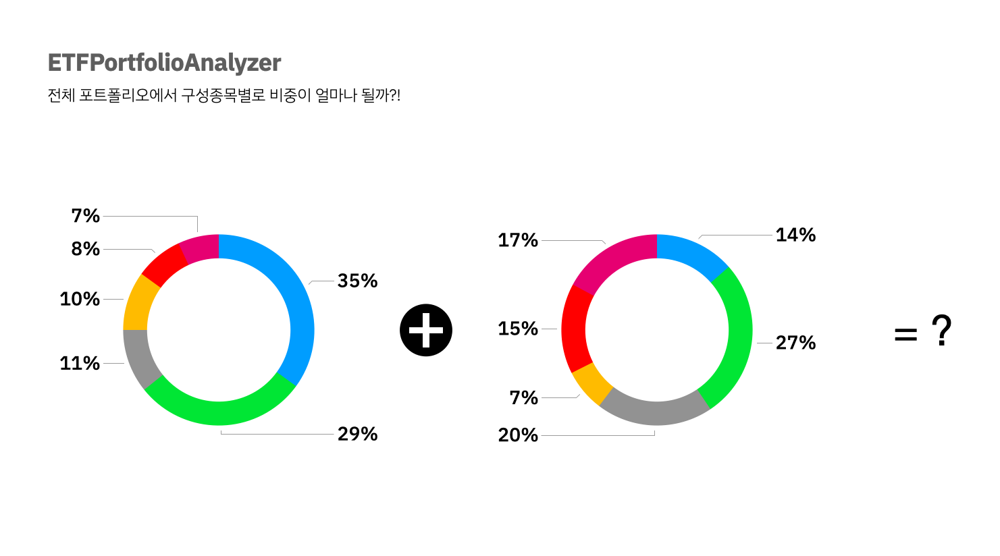

[](https://hits.seeyoufarm.com)

# ETFPortfolioAnalyzer

- "전체 포트폴리오에서 구성종목별로 비중이 얼마나 될까?"



- `KRX 정보데이터시스템`을 사용해 ETF 기준가와 구성종목 비중 수집

- 나의 매수가에 맞추어 전체 비중에서 각 개별종목이 차지하는 비중 계산

## Functions

- 보유한 ETF 종목 및 보유 주수 입력
- 전체 포트폴리오 비중 계산
- 시각화
- ETF 전체 목록 조회
- 각 ETF별 구성종목 조회

## APIs

### Request
`GET /etf/{CODE}`

```
curl -i -H `Accept: application/json` -d {HOST}/etf/407170
```

### Response

```
HTTP/1.1 200 OK
Date: Fri, 31 Dec 2021 12:00:00 GMT
Status: 200 OK
Connection: close
Content-Type: application/json
Content-Length: 504

{"output":[{"ISU_CD":"035720","ISU_ABBRV":"카카오","COMPST_ISU_CU1_SHRS":"320.00","VALU_AMT":"36,480,000","COMPST_AMT":"36,000,000","COMPST_RTO":"7.38"},{"ISU_CD":"051900","ISU_ABBRV":"LG생활건강","COMPST_ISU_CU1_SHRS":"31.00","VALU_AMT":"34,441,000","COMPST_AMT":"34,007,000","COMPST_RTO":"6.97"},{"ISU_CD":"035420","ISU_ABBRV":"NAVER","COMPST_ISU_CU1_SHRS":"59.00","VALU_AMT":"22,538,000","COMPST_AMT":"22,331,500","COMPST_RTO":"4.58"},{"ISU_CD":"066570","ISU_ABBRV":"LG전자","COMPST_ISU_CU1_SHRS":"159.00","VALU_AMT":"22,339,500","COMPST_AMT":"21,942,000","COMPST_RTO":"4.50"},{"ISU_CD":"036570","ISU_ABBRV":"엔씨소프트","COMPST_ISU_CU1_SHRS":"32.00","VALU_AMT":"21,120,000","COMPST_AMT":"20,576,000","COMPST_RTO":"4.22"},{"ISU_CD":"033780","ISU_ABBRV":"KT&G","COMPST_ISU_CU1_SHRS":"227.00","VALU_AMT":"18,091,900","COMPST_AMT":"17,933,000","COMPST_RTO":"3.68"},{"ISU_CD":"111770","ISU_ABBRV":"영원무역","COMPST_ISU_CU1_SHRS":"393.00","VALU_AMT":"17,213,400","COMPST_AMT":"17,154,450","COMPST_RTO":"3.52"},{"ISU_CD":"402340","ISU_ABBRV":"SK스퀘어","COMPST_ISU_CU1_SHRS":"230.00","VALU_AMT":"14,835,000","COMPST_AMT":"15,272,000","COMPST_RTO":"3.13"},{"ISU_CD":"000120","ISU_ABBRV":"CJ대한통운","COMPST_ISU_CU1_SHRS":"120.00","VALU_AMT":"15,180,000","COMPST_AMT":"15,120,000","COMPST_RTO":"3.10"},{"ISU_CD":"097950","ISU_ABBRV":"CJ제일제당","COMPST_ISU_CU1_SHRS":"38.00","VALU_AMT":"14,763,000","COMPST_AMT":"14,725,000","COMPST_RTO":"3.02"}],"CURRENT_DATETIME":"2021.12.31 PM 02:33:31"}
```

**2021-12-31 기준**

---

*개인 활용 용도로 개발하였으니, 해당 레포를 활용한 무분별한 API 요청을 자제해주시기 바랍니다.*